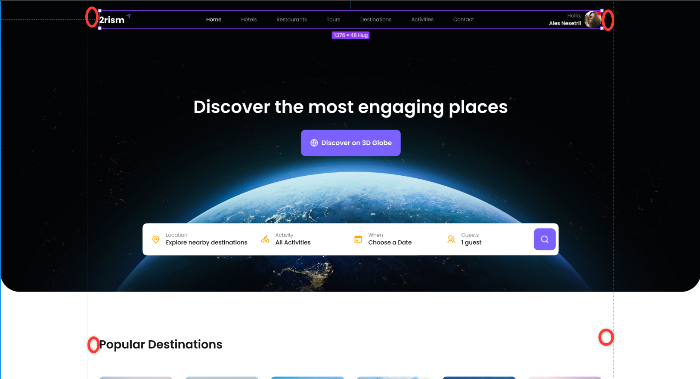
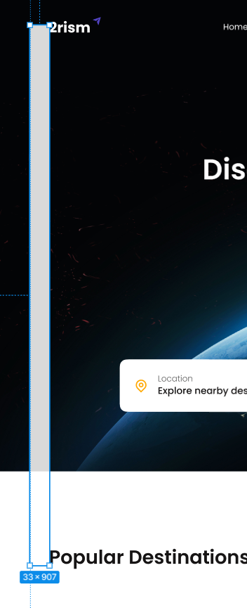
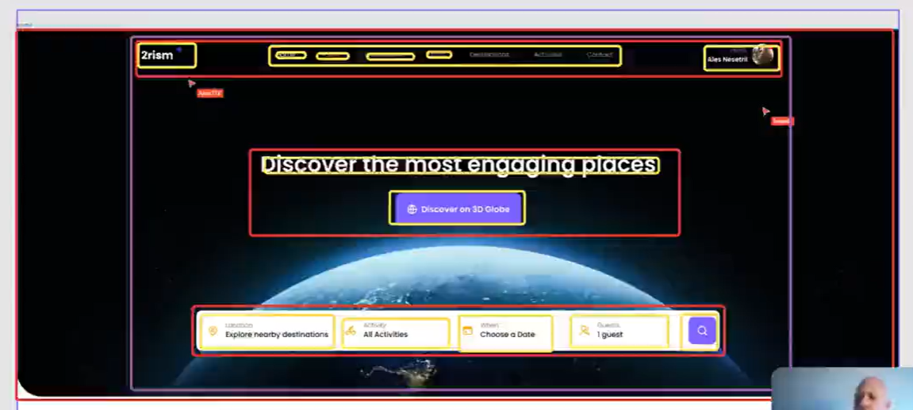
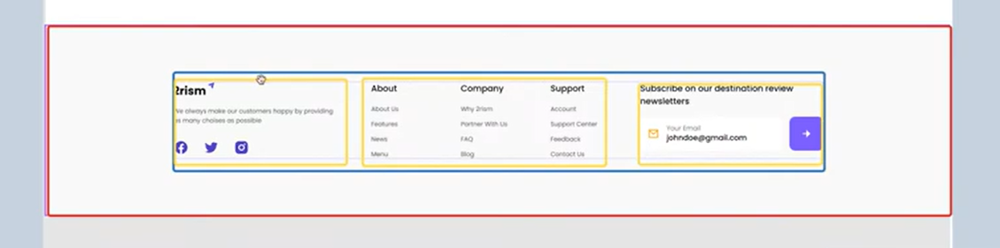

- background-repeat
- object-fit


1. `ctrl + shift` - выделяет несколько родственных изобржений (например, иконок). Выбираем изображение, нажимаем `ctrl + shift`, выделяем соседние элементы и эксортируем группу


+ `ctrl + shift` позволяет выделить группу названий (текст)

2. Подключение reset.css: https://webcademy.ru/blog/739/

3. Подключение шрифтов посредством fonts.google.com, через `@import`.

4. Плагин для подключения шрифтов через IDE: google fonts.

5. Пример структуры изображений в проекте
```javascript
assets/
├── images/
│   ├── backgrounds/          # Фоновые изображения (например, bg-header.jpg)
│   ├── photos/               # Фото контента
│   │   ├── about/            # Фото для секции "about" (если специфичны)
│   │   └── products/         # Фото товаров
│   └── icons/                # Все иконки
│       ├── ui/               # Общие UI-иконки
│       ├── social/           # Иконки соцсетей
│       └── thematic/         # Тематические иконки
└── sections/                 # Файлы секций (HTML, CSS, JS)
    ├── header/               # Файлы для header
    ├── footer/               # Файлы для footer
    └── about/                # Файлы для about (без изображений)
```

7. Верстку макетов проще делать по принципу "Desktop First", поскольку проще мыслить в парадигме "От большего – к меньшему".

**Контейнер**
Для расчёта ширины контейнера при вёрстке первого раздела важно проанализировать разметку контейнера для всего макета.

Для контейнера важно оставлять отступы слева и справа, чтобы контент не прилегал к краям экрана. Это особенно актуально для мобильных устройств.

В данном случае эти поля можно увидеть, выделив область контейнера:


Можно определить расстояние таким образом:


На контейенер можно повесить функцию распределения положения элементов на странице (добавляем модификатор container--header).
```html
<header class="header">
    <div class="container container--header">
        ...
    </div>
</header>
```
```css
.container--header {
    height: 100%; /* Растяжение контейнера по всей шапке */
    display: flex;
    flex-direction: column;
    justify-content: space-between;
}

/* Для выстраивания элементов в блоке важно, чтобы в .header высота была указана в height, а не min-height  */
```

+ Не рекомендуется делать один контейнер на весь макет. Можно сделать container для шапки, отдельно для контента (main + section), и ещё один для футера.

+ Можно придерживаться стиля: секция - внутри неё контейнер - элементы. Это защищает от правок всего контейнера, когда появляются задачи вроде карусели на всю ширину экрана или блок CTA.


### Структура разделов 
**discover**


**Popular**
- Стоит ли использовать article?

**Travel (мой набросок)**



### CSS-свойства
1. `background-size: cover` - это значение заставляет фоновое изображение полностью покрыть контейнер, сохраняя пропорции. 

Изображение масштабируется так, чтобы его ширина и высота полностью совпали с шириной или высотой контейнера, сохранив при этом исходные пропорции изображения. Если пропорции изображения и контейнера не совпадают, часть изображения будет обрезана.

Если изображение шире контейнера – оно растягивается по высоте, а по ширине будет растягиваться слева и справа. Если изображение выше конейнера - оно растянется по ширине, а по высоте будет обрезано.

Используем для полноэкранных фоновых изображений, когда нужно заполнить всё пространство контейнера, в слайдерах и каруселях, для эффективных "обложек" разделов сайта.

2. `background-position: center` - это значение центрирует фоновое изображение внутри контейнера.

Изображение выравнивается по центру как по горизонтали, так и по вертикали. Это эквивалентно записи `background-position: 50% 50%`. При изменении пропорций контейнера изображение становится отцентрированным.

Значение может быть в пикселях (10px 20px), процентах (25% 75%), ключевых словах (top, right, botom, left) + комбинациях ключевых слов (center top, right center) и т.д.

**Совместное использование**
Комбинация `background-size: cover` и `background-position: center` - стандартный паттерн для фоновых изображений:
```css
.element {
    background-image: url('image.jpg');
    background-size: cover;
    background-position: center;
    background-repeat: no-repeat; /* Предотвращает повторение */
}
```
Благодаря этой комбинации, изображение заполняет весь контейнер без искажений пропорций. Изображение отцентрировано - визуально сбалансировано. Нет повторения - изображение отображается один раз. При изменении размера контейнера изображение перемасштабируется и остаётся центрированнымю

**Дополнительно**
1. Производительность. Большие изображения могут замедлять загрузку, необходимо использовать оптимизированные файлы.
2. Доступность. Фоновые изображения не видны скринридерам. Если изображение несёт смысловую нагрузку, нужно использовать `` + `alt`.
3. Кросс-браузерность. Оба свойства поддерживаются всеми современными браузерами.
4. Порядок свойств. Можно объединять в `background`, но лучше писать отдельно для читаемости.

+ Добавить `background-repeat: no-repeat`, чтобы изображение не дублировалось. 
+ Использовать медиа-запросы для подгрузки различных изображений для разных устройств.
+ Рассмотреть свойство `object-fit` для `img`, если нужно аналогичное поведение для контентных изображений
+ Для сложных случаев использовать несколько фоновых изображений через запятую.


## Вопросы на проработку
- Когда лучше использовать SVG, когда - PNG и в чём отличие?
- Как рекомендуется размещать иконки - все в отдельной папке или создавать отдельную секцию внутри каждого блока?


### Соответствие размера шрифта значениям font-size
- 100 - Thin / Hairline
- 200 - Extra Light / Ultra Light
- 300 - Light
- 400 - Normal / Regular
- 500 - Medium
- 600 - Semi Bold / Demi Bold
- 700 - Bold
- 800 - Extra Bold / Ultra Bold
- 900 - Black / Heavy